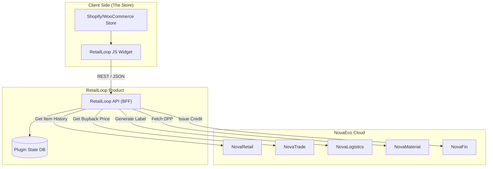

# 🛍️ RetailLoop

> **The "One-Click Resale" Plugin for E-commerce.**
> Instantly upgrade any online store with Buy-Back, Resale, and Digital Product Passport features.

[](https://www.google.com/search?q=https://github.com/novaeco-tech/product-retail-loop/actions)
[](https://opensource.org/licenses/MIT)
[](https://www.google.com/search?q=https://retail-loop.novaeco.tech)

**RetailLoop** is a "Circular-as-a-Service" plugin. It integrates with existing e-commerce storefronts to close the loop on sold products. It allows brands to offer instant buy-back quotes, display sustainability data, and manage reverse logistics without leaving their native platform.

-----

## 🎯 Value Proposition

Brands are facing pressure from the **EU Ecodesign Regulation** and **Right to Repair** laws. **RetailLoop** solves this by injecting three key buttons into the customer's "Order History" page:

1.  **🔄 Resell / Trade-In:** "Get €20 credit for returning this jacket."
2.  **🔧 Repair:** "Book a repair service for this item."
3.  **📄 View Passport:** "See the Digital Product Passport (DPP)."

-----

## 🏗️ Architecture (BFF Pattern)

This product follows the **Backend-for-Frontend (BFF)** pattern. The `RetailLoop API` acts as the middleware between the 3rd-party E-commerce platform (e.g., Shopify) and the NovaEco backend.



### Integrated Services

  * **[NovaRetail](https://www.google.com/search?q=https://retail.novaeco.tech):** The master record of the "Usage Phase." Tracks who owns the item now.
  * **[NovaTrade](https://www.google.com/search?q=https://trade.novaeco.tech):** The pricing engine. Calculates the "Instant Buy-Back Price" based on market demand for used items.
  * **[NovaLogistics](https://www.google.com/search?q=https://logistics.novaeco.tech):** Generates the QR code shipping label for the return.
  * **[NovaFin](https://www.google.com/search?q=https://finance.novaeco.tech):** Issues the store credit or refund token once the item is scanned at the warehouse.

-----

## ✨ Key Features

### 1\. The "Smart Resale" Widget

A JavaScript SDK that embeds into the merchant's "My Account" page.

  * **Auto-Detection:** Automatically lists items eligible for trade-in from the user's order history.
  * **Instant Quote:** "We will pay you €15 for this 2-year-old T-shirt." (Powered by `NovaTrade`).

### 2\. Digital Product Passport (DPP) Viewer

Complies with EU regulations by displaying the full material provenance.

  * **Data Source:** Fetches real-time JSON-LD data from `NovaMaterial`.
  * **Display:** Shows Recyclability Score, Carbon Footprint, and Repair Manuals.

### 3\. Automated Reverse Logistics

Eliminates the friction of returns.

  * **Printer-less Returns:** Generates a QR code for the user to show at a drop-off point.
  * **Routing:** `NovaLogistics` decides if the item goes to:
      * **Resale Warehouse** (Good condition)
      * **Repair Center** (Needs fixing)
      * **Recycling Facility** (End of life)

-----

## 🚀 Getting Started

### Prerequisites

  * Node.js v20+
  * Python 3.11+
  * A Shopify Partner Account (for testing the integration)

### Installation

1.  **Clone the repo:**
    ```bash
    git clone https://github.com/novaeco-tech/product-retail-loop.git
    cd product-retail-loop
    ```
2.  **Start the Dev Environment:**
    ```bash
    make dev
    ```
      * **Widget (JS SDK):** http://localhost:3000/sdk.js
      * **BFF API:** http://localhost:8000/docs
      * **Demo Store:** http://localhost:3000/demo

### Integration (For Merchants)

Add this snippet to your store's `order-history.liquid` or template file:

```html
<script 
  src="https://retail-loop.novaeco.tech/sdk.js" 
  data-api-key="YOUR_PUBLIC_KEY"
  data-store-id="SHOPIFY_STORE_123">
</script>
<div id="retail-loop-widget"></div>
```

-----

## 📂 Repository Structure

```text
product-retail-loop/
├── api/                # Python/FastAPI (The BFF)
│   ├── src/
│   │   ├── webhooks/   # Handlers for Shopify/WooWebhooks
│   │   ├── pricing/    # Logic to query NovaTrade
│   │   └── labels/     # Logic to query NovaLogistics
├── app/                # Next.js (The Admin Dashboard for Merchants)
│   ├── src/
│   │   ├── widget/     # The embeddable JS SDK (Preact/React)
│   │   └── dashboard/  # Merchant settings UI
├── website/            # Documentation (Docusaurus)
└── tests/              # End-to-End Cypress tests
```

-----

## 🔌 API Reference (Internal BFF)

These endpoints are used by the Frontend Widget.

  * `GET /v1/eligibility?sku=123`
      * Checks `NovaRetail` to see if the item is eligible for buy-back.
  * `POST /v1/quote`
      * Input: `{ sku, condition: 'good' }`
      * Output: `{ offer_price: 25.00, currency: 'EUR' }` (Source: `NovaTrade`)
  * `POST /v1/trade-in`
      * Creates a return shipment in `NovaLogistics`.
      * Returns a PDF label or QR code URL.

-----

## 🤝 Contributing

We specifically need help with **Platform Adapters** (plugins for Magento, BigCommerce, PrestaShop).
See [CONTRIBUTING.md](https://www.google.com/search?q=../.github/CONTRIBUTING.md) for details.

**Maintainers:** `@novaeco-tech/maintainers-product-retail-loop`